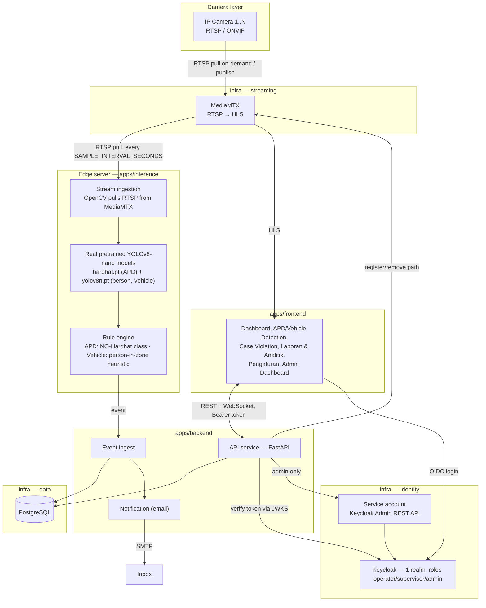

# High-Level Design — Smart CCTV AI

Status: demo/POC for Pertamina EP · Last updated: 8 Sep 2026

## 1. Purpose & scope

Smart CCTV AI is an on-premise computer-vision platform that watches
existing CCTV cameras and raises alerts for two violation classes:

- **Safety Detection (APD)** — e.g. personnel without a helmet in a work zone.
- **Vehicle Violation** — e.g. a passenger riding in a truck bed.

This document covers the **platform** — how cameras get onboarded, how a
detection event travels from edge to operator, how identity and streaming
are wired. **Training** a detection model is still explicitly out of
scope (see [ADR-0003](adr/0003-simulated-inference.md) for that original
boundary and why) — but the platform now runs **real inference** using
small, off-the-shelf pretrained models rather than a random event
generator, so it can be demoed end to end on real (if placeholder) camera
footage. See [ADR-0010](adr/0010-real-pretrained-inference.md) for what
changed, what's still a heuristic rather than a trained capability, and
why.

## 2. Deployment shape

Single on-premise edge server, one Docker Compose project, one reverse
proxy as the sole public entry point. No cloud dependency on the critical
path — the only outbound call is SMTP for email alerts.



## 3. Repository layout

```
smart-cctv-ai/                # checkout folder — see ADR-0016 for why this name isn't load-bearing
├── docker-compose.yml        # root: `include:`s the two below, pins the Compose project name
├── assets/brand/             # canonical Pertamina EP logo (see ADR-0009)
├── apps/                     # the product
│   ├── docker-compose.yml
│   ├── backend/              # FastAPI — cameras, violations, auth, admin API
│   ├── frontend/             # 6 pages + admin.html — vanilla JS, no build step (see ADR-0011)
│   └── inference/            # real pretrained-model inference worker (see ADR-0010; superseded and deleted the earlier inference-sim)
├── infra/                    # supporting infrastructure
│   ├── docker-compose.yml
│   ├── keycloak/             # realm import + custom login theme
│   ├── mediamtx/             # RTSP → HLS config
│   ├── reverse-proxy/        # nginx, single ingress
│   └── demo-camera/          # loops real demo photos as RTSP sources (no live cameras on the lab host)
├── docs/                     # this folder
└── product/                  # BRD, PRD, roadmap
```

Why `apps/` vs `infra/` at all, and why split their compose files the way
they are, is its own decision — see
[ADR-0007](adr/0007-repo-and-compose-layout.md).

## 4. Single ingress (reverse proxy)

All web traffic enters through `reverse-proxy` (Nginx) on port **80**,
routed by path — this removes any need for cross-origin CORS handling and
keeps the open port surface small. Rationale: [ADR-0002](adr/0002-single-ingress-reverse-proxy.md).

| Path      | Forwarded to | Notes |
|-----------|--------------|-------|
| `/`       | `frontend`   | Dashboard, APD/Vehicle Detection, Case Violation, Laporan & Analitik, Pengaturan, Admin Dashboard |
| `/api/*`  | `backend`    | REST API, Bearer token required (except `/api/health`) |
| `/ws/*`   | `backend`    | WebSocket live alert feed |
| `/auth/*` | `keycloak`   | OIDC endpoints only — `/auth/admin/*` is blocked here |
| `/hls/*`  | `mediamtx`   | HLS playlists/segments |

Ports exposed outside the reverse proxy, each for a distinct reason:
**8081** (Keycloak's own admin console, deliberately off the app's port —
[ADR-0002](adr/0002-single-ingress-reverse-proxy.md)), **8554** (RTSP, for
camera publish/pull and external VMS clients), **8025** (Mailpit web UI).

## 5. Services

| Service | Domain | Role |
|---|---|---|
| `backend` | apps | FastAPI — camera/violation CRUD, WebSocket, token verification, email, Keycloak admin bridge, snapshot storage |
| `frontend` | apps | 6-page role-aware dashboard (`shell.js` sidebar hides Pengaturan for non-admin) + Admin Dashboard — see [ADR-0011](adr/0011-real-app-ia-and-rbac-backport.md) |
| `inference` | apps | Real pretrained-model inference worker (YOLOv8-nano ×2), polls live confidence thresholds — see [ADR-0010](adr/0010-real-pretrained-inference.md) |
| `postgres` | infra | Camera, violation (status/assign/notes), and notification-rule data |
| `minio` | infra | Open-source S3-compatible object storage for violation snapshot evidence — see [ADR-0017](adr/0017-minio-object-storage-and-date-range-reports.md) |
| `keycloak` + `postgres-keycloak` | infra | SSO/OIDC, 1 realm / 3 roles (operator, supervisor, admin) — see [ADR-0001](adr/0001-single-realm-rbac.md), [ADR-0011](adr/0011-real-app-ia-and-rbac-backport.md) |
| `mediamtx` + `demo-camera-*` (×5) | infra | RTSP → HLS streaming — see [ADR-0005](adr/0005-mediamtx-for-streaming.md) |
| `mailpit` | infra | SMTP catcher for demo email (both app notifications and Keycloak's own password-reset mail) |
| `reverse-proxy` | infra | Single ingress — see [ADR-0002](adr/0002-single-ingress-reverse-proxy.md) |

Full detail (schemas, endpoints, sequence flows) is in [LLD.md](LLD.md).

## 6. Non-functional notes

- **Persistence**: `postgres` and `postgres-keycloak` data, and Mailpit's
  inbox, survive restarts via named volumes. MediaMTX's dynamically
  registered camera paths live in memory only — `backend` re-asserts them
  on startup and every 5 minutes so a MediaMTX-only restart self-heals
  (see [troubleshooting.md](../runbook/troubleshooting.md)).
- **Security posture for this deploy**: plain HTTP on a lab LAN, no TLS.
  Demo credentials are in [`credentials.md`](../runbook/credentials.md)
  and must be rotated before any real rollout.
- **RBAC enforcement point**: role checks (`get_current_admin`,
  `get_current_manager` in `apps/backend/app/auth.py`) live on the
  backend, not the frontend — `apps/frontend` hiding a nav item or
  disabling a button is a UX nicety on top of that, never the actual
  access control. See [ADR-0011](adr/0011-real-app-ia-and-rbac-backport.md)'s
  RBAC matrix.
- **Scale**: sized for the 10–50 camera MVP range from the original plan.
  No message broker yet between inference and the API — fine at this
  scale, revisit if a real multi-GPU inference fleet is added.
- **CPU-only inference**: `inference` runs two YOLOv8-**nano** models
  specifically so it works without a GPU on the lab host — expect on the
  order of 1 processed frame per camera every `SAMPLE_INTERVAL_SECONDS`
  (default 4s), not real-time video-rate. Fine for periodic sampling at
  demo/PoC scale; a real multi-camera, low-latency rollout should plan for
  GPU inference (see [ADR-0010](adr/0010-real-pretrained-inference.md)).

## 7. What's simulated vs real

| Piece | Status |
|---|---|
| Camera streaming (RTSP → HLS via MediaMTX) | **Real** |
| Authentication (Keycloak, PKCE, RBAC) | **Real** |
| Email notifications (SMTP) | **Real**, pointed at a local catcher instead of a corporate mail server |
| Camera/violation CRUD, WebSocket live feed | **Real** |
| Camera footage itself | **Placeholder** — real (CC-licensed) photos looped by `demo-camera`, not live cameras; see `infra/demo-camera/images/NOTICE.md` |
| APD detection (no-hardhat) | **Real inference**, pretrained model, unmodified — [ADR-0010](adr/0010-real-pretrained-inference.md) |
| Vehicle violation detection | **Real person detection** + a **zone heuristic** standing in for a trained "truck-bed rider" class, which doesn't exist pretrained — [ADR-0010](adr/0010-real-pretrained-inference.md) |
| Model **training** | Still out of scope — both models are used exactly as published, no fine-tuning done here |
