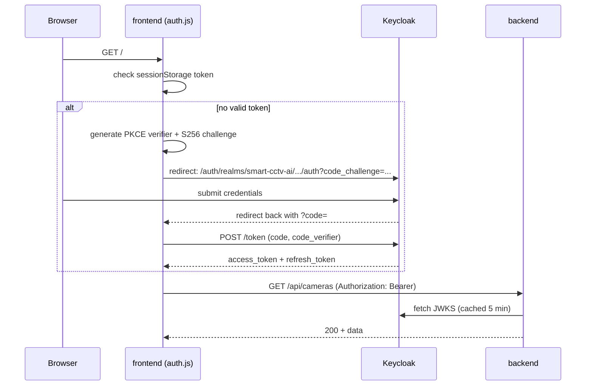
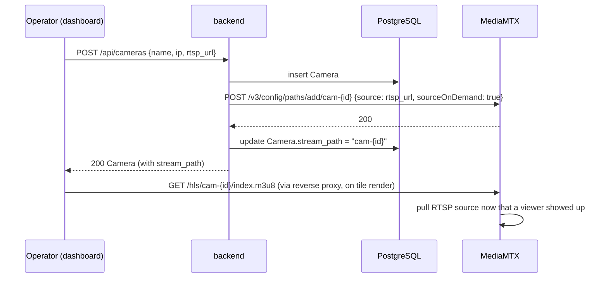
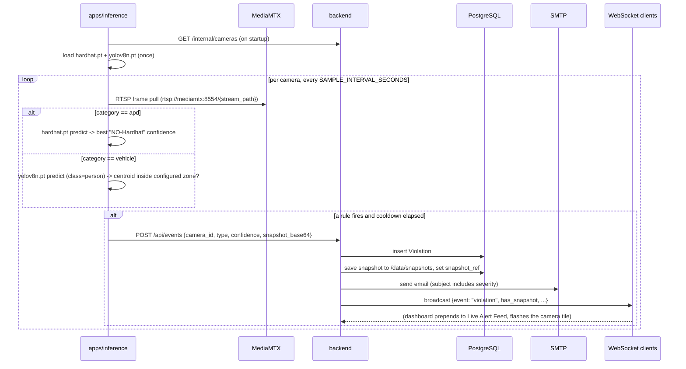
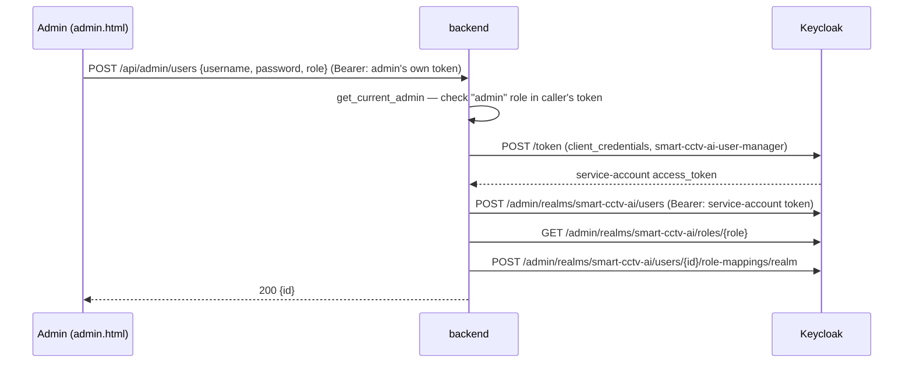

# Low-Level Design — Smart CCTV AI

Companion to [HLD.md](HLD.md). Covers data model, API surface, and the
sequence of a few flows worth tracing end to end.

## 1. Data model (`apps/backend/app/models.py`)

```
Camera
├── id                PK
├── name
├── ip_address         unique
├── location           nullable
├── status             "online" | "offline" (default "online")
├── category           "apd" | "vehicle" (default "apd") — picks which model apps/inference runs
├── rtsp_url           nullable — set when a real/demo RTSP source exists
├── stream_path        nullable — MediaMTX path name once registered
└── created_at

Violation
├── id                 PK
├── camera_id          FK -> Camera
├── type               "no_helmet" | "truck_bed_rider"
├── label              human-readable, from VIOLATION_META
├── category           "apd" | "vehicle" (renamed from "safety" -> "apd" in ADR-0011, one-time UPDATE on upgrade)
├── severity           "warning" | "critical"
├── confidence         float 0..1
├── snapshot_ref        nullable — MinIO object key (ADR-0017), set when the
│                       inference worker sends `snapshot_base64`; served back via GET /api/violations/{id}/snapshot
├── acknowledged       bool — legacy, kept in sync with status != 'baru' (ADR-0011)
├── status             "baru" | "diproses" | "selesai" (ADR-0011) — 'selesai' requires Supervisor/Admin
├── assigned_to        nullable string — free-text name, Supervisor/Admin only (ADR-0011)
├── escalated_at       nullable — set once _periodic_escalation_check has sent the escalation email for this case
├── responded_at       nullable — first time status left 'baru'; the "avg response time" metric
└── created_at

ViolationNote  (ADR-0011 — Case Detail's "Catatan Investigasi")
├── id                 PK
├── violation_id       FK -> Violation
├── author             string — from the caller's token (name/preferred_username)
├── text
└── created_at

NotificationRule  (ADR-0011 — Pengaturan > Aturan Notifikasi, one row per category)
├── category               PK, "apd" | "vehicle"
├── min_confidence         float 0..1 — polled by apps/inference (30s cache), controls live detection sensitivity
├── escalate_after_minutes int
├── escalate_enabled       bool
└── email_enabled          bool
```

`category` was added after the table already existed in earlier deploys —
`main.py`'s `_run_schema_migrations()` does an idempotent
`ALTER TABLE ... ADD COLUMN IF NOT EXISTS` on startup so upgrading in
place doesn't require dropping the postgres volume; `_backfill_demo_camera_data()`
then re-asserts the correct category/stream_path for the fixed demo IPs
only (never touches a camera a real admin added).

`VIOLATION_META` in `models.py` is the single source of truth mapping a
violation `type` to its label/category/severity — `apps/inference` only
ever needs to know the `type` string.

## 2. API surface (`apps/backend/app/main.py`)

| Method & path | Auth | Purpose |
|---|---|---|
| `GET /api/health` | none | Liveness check |
| `GET /api/cameras` | user | List cameras |
| `POST /api/cameras` | **admin role** | Create camera; registers MediaMTX path if `rtsp_url` given |
| `GET /api/cameras/{id}` | user | Camera detail |
| `PUT /api/cameras/{id}` | **admin role** | Edit name/location/category/rtsp_url; re-registers or removes the MediaMTX path as needed |
| `DELETE /api/cameras/{id}` | **admin role** | Delete camera + its violations; removes its MediaMTX path |
| `GET /api/violations` | user | List, filterable by `type`, `category`, `status`, `camera_id`, `only_unacknowledged` |
| `GET /api/violations/{id}` | user | Detail incl. `notes[]` — powers the Case Detail modal |
| `PUT /api/violations/{id}/status` | user (**manager role** to set `selesai`) | Change status; also syncs `acknowledged` and sets `responded_at` on first move off `baru` |
| `POST /api/violations/{id}/ack` | user | Legacy alias for status -> `diproses`, kept for backward compatibility |
| `PUT /api/violations/{id}/assign` | **manager role** | Set/clear `assigned_to` |
| `POST /api/violations/{id}/notes` | user | Add a case note (author = caller's token name) |
| `GET /api/violations/{id}/snapshot` | user | JPEG captured by `apps/inference` at detection time; 404 if none was sent |
| `GET /api/reports/summary` | user | Category split, daily trend, per-camera ranking, completion rate, avg response time — `?start=&end=` (ISO dates, inclusive, max 31 days apart — ADR-0017) |
| `GET /api/reports/export` | token | PDF export, `?kind=executive\|detail&start=&end=` — see ADR-0015/0017 |
| `GET /api/users/operators` | manager | Real operator accounts for the case-assignment dropdown, not a hardcoded list |
| `GET /api/notification-rules` | **admin role** | List per-category rules (Pengaturan > Aturan Notifikasi) |
| `PUT /api/notification-rules/{category}` | **admin role** | Update one category's rule (partial update) |
| `GET /api/stats` | user | Dashboard summary counters |
| `GET /api/admin/users` | **admin role** | List Keycloak users (via service account) |
| `POST /api/admin/users` | **admin role** | Create a Keycloak user + assign a realm role (operator/supervisor/admin) |
| `PUT /api/admin/users/{id}/enabled` | **admin role** | Enable/disable a Keycloak user |
| `GET /internal/cameras` | none (internal network only) | Camera list (incl. `category`) for `apps/inference` — never reaches the reverse proxy |
| `GET /internal/notification-rules` | none (internal network only) | Rules mirror for `apps/inference` to poll its confidence threshold from |
| `POST /api/events` | none (internal network only) | Violation ingest from the inference worker; optional `snapshot_base64` |
| `WS /ws/live` | user (token as `?token=` query param) | Live violation push |

"user" = any valid Keycloak access token for the `smart-cctv-ai` realm
(`get_current_user`). "admin role" = valid token **and** `admin` in
`realm_access.roles` (`get_current_admin`). "manager role" = `admin`
**or** `supervisor` (`get_current_manager`) — see
[ADR-0001](adr/0001-single-realm-rbac.md) for the original single-realm
decision and [ADR-0011](adr/0011-real-app-ia-and-rbac-backport.md) for
the 3-role matrix these dependencies enforce.

## 3. Sequence: operator login (browser)



The `code_challenge` step is why `apps/frontend/auth.js` carries a pure-JS
SHA-256 fallback — `crypto.subtle` doesn't exist on a plain-HTTP origin
(only in secure contexts), which silently broke this exact step the first
time around. See [troubleshooting.md](../runbook/troubleshooting.md).

## 4. Sequence: add a camera with a real RTSP URL



If `register_pull_path` fails (MediaMTX unreachable, bad URL), the camera
is still created — `stream_path` just stays `null` and the tile shows "no
signal" instead of blocking the whole request.

## 5. Sequence: violation detected → operator sees it



See [ADR-0010](adr/0010-real-pretrained-inference.md) for why the vehicle
path is a zone heuristic on top of real person detection rather than a
trained "truck-bed rider" class.

## 6. Sequence: admin creates a new user



The admin's own browser token never touches the Keycloak Admin REST API
directly — it only proves (via the `admin` role) that they're allowed to
ask the backend to act. See [ADR-0006](adr/0006-service-account-for-admin-api.md).

## 7. Environment variables

Every `${VAR}` used in `apps/docker-compose.yml` and
`infra/docker-compose.yml` is supplied by the single `.env` at the repo
root (Compose resolves `.env` relative to where you invoke `docker
compose`, not relative to each included file). See that file for the
full list; secrets there are demo-only, see
[credentials.md](../runbook/credentials.md).
